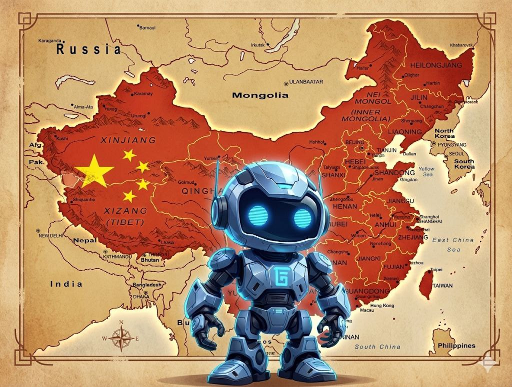

<h1 style="border: none; margin-top: 20px; margin-bottom: 10px;">
  
    AI Security China
  
  🇨🇳
</h1>

  🛡️ <strong>Comprehensive Intelligence Hub</strong> for China's AI Security Ecosystem

  From cutting-edge model protection to regulatory compliance • Real incidents • Market leaders

  
  
  
  

  

## 📋 Contents

- [🏢 Companies & Solutions](#companies--solutions)
  - [🔒 Model Security & Integrity](#model-security--integrity)
  - [🌐 Network Security & Firewalls](#network-security--firewalls)
  - [🔐 AI Content Security & Safeguards](#ai-content-security--safeguards)
  - [☁️ Cloud & MLSecOps Platforms](#cloud--mlsecops-platforms)
  - [🔴 Red Teaming & Testing Platforms](#red-teaming--testing-platforms)
  - [🔐 Privacy-Preserving Computing](#privacy-preserving-computing)
- [📜 Regulatory Framework](#regulatory-framework)
- [🔬 Research & Standards](#research--standards)
- [🚨 Notable Security Incidents & Research](#notable-security-incidents--research)

---

## 🏢 Companies & Solutions

  

### 🔒 Model Security & Integrity

#### 🏢 RealAI (Beijing RealAI Intelligent Technology)

> **🎯 Focus:** Third-generation AI security - safe, reliable, and controllable AI
> 
> **🚀 Key Products:**
> - **RealSafe 2.0** - Enterprise-grade AI model security assessment platform
> - **Large Model Security Base** - Comprehensive LLM protection with automated Red Teaming
> - **Deepfake Detection** - Specialized solutions for banking and payment systems
> 
> **🔧 Specialization:** Model integrity • Adversarial defense • Backdoor detection  
> **📈 Market Position:** Specialized in model security with partnerships including major AI companies  
> **🏛️ Background:** Beijing-based AI security company

---

### 🌐 Network Security & Firewalls

#### 🏢 [Sangfor Technologies](https://www.sangfor.com/)

> **🎯 Focus:** Evolution of perimeter defense for the AI era
> 
> **🚀 Key Products:**
> - **[Sangfor Athena & Network Secure](https://www.sangfor.com/cybersecurity/products/network-secure-next-generation-firewall)** - Next-generation firewall with AI capabilities
> - **Security GPT** - AI-powered security analysis platform
> - **SynergyAI Technology** - Advanced threat detection without decryption
> 
> **🔧 Specialization:** "AI Firewall" concept • Integrated NGFW, WAF, SOC Lite solutions  
> **📈 Market Position:** Strong in Asian SMB market • Unified management console  
> **🌏 Global Reach:** Serving enterprises across Asia-Pacific region

---

### 🔐 AI Content Security & Safeguards

#### 🏢 [Chaitin Tech](https://www.chaitin.cn/)

> **🎯 Focus:** AI-powered security solutions and content protection
> 
> **🚀 Key Products:**
> - **[SafeLine WAF](https://github.com/chaitin/SafeLine)** - Open-source WAF with AI-enhanced detection
> - **AI Security Extensions** - Specialized modules for AI-generated threat detection
> 
> **💡 Business Model:** Freemium strategy targeting startups and tech companies  
> **🔧 Specialization:** AI-enhanced web security • Protection against AI-powered attacks  
> **🌟 Community:** Strong developer community support • Active GitHub presence

---

### ☁️ Cloud & MLSecOps Platforms

#### 🏢 [Tencent Cloud](https://cloud.tencent.com/)

> **🚀 Key Products:** [TI-Platform](https://cloud.tencent.com/product/ti) - Full MLSecOps lifecycle capabilities  
> **🔧 Specialization:** Complete MLSecOps pipeline • Adversarial example generation  
> **🌐 Integration:** Seamless integration with Tencent's cloud ecosystem

#### 🏢 [Baidu](https://cloud.baidu.com/)

> **🚀 Key Products:** [PaddlePaddle Security (PaddleSleeve)](https://www.paddlepaddle.org.cn/documentation/docs/zh/guides/09_security/index_cn.html) - Framework security module  
> **🔧 Specialization:** Security integrated at code level within Baidu's AI ecosystem  
> **🏗️ Architecture:** Built into PaddlePaddle deep learning framework

#### 🏢 [Huawei Cloud](https://www.huaweicloud.com/)

> **🚀 Key Products:** Pangu Guard • [MindSpore MindArmour](https://www.mindspore.cn/mindarmour/docs/en/master/index.html) - Hardware-level protection  
> **🔧 Specialization:** Sovereign AI stack security • Hardware-integrated protection  
> **🏭 Focus:** Made in China 2025 initiative • Reducing foreign technology dependency

---

### 🔴 Red Teaming & Testing Platforms

#### 🏢 [Tencent AI-Infra-Guard (A.I.G)](https://github.com/Tencent/AI-Infra-Guard)

> **🎯 Focus:** Comprehensive AI Red Teaming platform for security assessment
> 
> **🚀 Key Features:**
> - **AI Infrastructure Scanning** - One-click vulnerability discovery
> - **MCP Server Security Analysis** - Model Context Protocol risk analysis
> - **Jailbreak Evaluation** - Comprehensive LLM security testing
> - **Plugin Management** - Extensible framework for custom tests
> 
> **🔧 Capabilities:** Multi-language support • Cross-platform compatibility • Docker deployment  
> **🏆 Recognition:** Active GitHub project • Strong community support • Major tech companies usage  
> **🔬 Research Impact:** Referenced in multiple academic papers on AI security  
> **📖 Documentation:** [Complete user guide](https://tencent.github.io/AI-Infra-Guard/)

#### 🏢 [SenseTime](https://www.sensetime.com/)

> **🎯 Focus:** AI model development with integrated security partnerships  
> **🤝 Partnerships:** Strategic collaboration with RealAI for security solutions  
> **🔧 Specialization:** Computer vision • Large language models with security integration

#### Additional AI Security Solutions

##### 🏢 [360 Security Group](https://www.360.com/)

> **🎯 Focus:** AI-powered cybersecurity solutions for enterprise digital transformation  
> **🚀 Key Products:** 360 Security Big Models • AI-Enhanced SOC with incident response  
> **🔧 Specialization:** 20+ years cybersecurity experience with AI technologies  
> **📈 Market Position:** Major Chinese cybersecurity vendor with AI focus

##### 🏢 [Venustech (Qimingxingchen)](https://www.venustech.com.cn/)

> **🎯 Focus:** "Security for AI" strategy protecting AI applications themselves  
> **🚀 Key Products:** Model Application Firewall (MAF) • Tianqing MAF for LLM protection  
> **🔧 Innovation:** "New Three-Piece Set" - MAF, MASB, MAVAS for layered AI defense  
> **📈 Market Position:** Leading provider of AI application security solutions

##### 🏢 [Zhipu AI](https://www.zhipuai.cn/)

> **🎯 Focus:** Security through architecture in LLM development  
> **🚀 Key Products:** GLM-4.5 and GLM-4.6 models with MoE architecture (MIT license)  
> **🔧 Philosophy:** Full control over data and infrastructure for better security  
> **📈 Strategy:** Active hiring of security specialists • Industry standards participation

---

##### Research & Testing Platforms
**[MCPLIB Framework](https://www.alphaxiv.org/overview/2508.12538v1)** provides a simulation framework for studying agent attacks, identifying 31 types of attacks on agents. **[MCPSecBench](https://arxiv.org/html/2508.13220)** offers systematic security benchmarks for Model Context Protocol testing. **[MCPGuard](https://arxiv.org/abs/2510.23673)** delivers automated vulnerability detection for MCP servers.

**Agent Security Bench (ASB)** became the academic and industrial standard for agent security evaluation, adopted at ICLR 2025. The benchmark formalizes agent attacks including Indirect Prompt Injection, agent memory attacks, and unauthorized file system access attempts, providing quantitative assessment of agent resilience to manipulation when interacting with untrusted content.

### 🔐 Privacy-Preserving Computing

#### [FATE (WeBank)](https://github.com/FederatedAI/FATE)
**🎯 Focus**: Industrial federated learning standard developed by Chinese WeBank, now under Linux Foundation

**🚀 Key Features**: Heterogeneous federated learning allowing participants with different model architectures and data structures to join unified training networks. Critical for cross-industry collaboration (banking + telecom). 2025 roadmap includes deep LLM integration for federated fine-tuning without sharing model weights or training data.

**🔧 Specialization**: De-facto standard for industrial federated AI in China  
**📈 Adoption**: Widely used across Chinese financial and healthcare sectors  
**🏛️ Origin**: Created by WeBank (Tencent affiliate), China's first digital bank

#### [SecretFlow (Ant Group)](https://github.com/secretflow/secretflow)
**🎯 Focus**: Comprehensive privacy-preserving computing platform by Chinese fintech giant Ant Group

**🚀 Key Products**: SecretFlow Cloud launched in 2025 addressing IP protection for LLM usage. Combines Multi-Party Computation (MPC), Homomorphic Encryption (HE), and Trusted Execution Environments (TEE) for "blind" computations where model owners can't see user queries and users can't access model weights.

**🔧 Innovation**: SCQL (Secure Collaborative Query Language) enabling SQL queries on distributed encrypted databases with differential privacy guarantees.

**📈 Market Position**: Leading Chinese solution for secure AI monetization without data exposure  
**🏛️ Origin**: Developed by Ant Group (Alibaba affiliate), operator of Alipay

#### [PrimiHub (Yuanyu Tech)](https://github.com/primihub/primihub)
**🎯 Focus**: High-performance Private Set Intersection (PSI) protocols by Chinese cryptography experts

**🚀 Key Features**: Simplified Docker deployment and Python SDK integration lowering entry barriers for developers without deep cryptography knowledge. Actively used in marketing analytics scenarios allowing companies to find common customers without sharing client databases.

**🔧 Specialization**: Cryptographic performance optimization for practical deployment  
**🏛️ Origin**: Developed by Chinese cryptography specialists at Yuanyu Technology

#### LatticeX Foundation (PlatON)
**🎯 Focus**: Blockchain-based infrastructure for confidential computing

**🚀 Innovation**: PlatON platform combining AI, cryptography, and blockchain where blockchain verifies data exchange and calculations while MPC performs actual computations. Creates secure data marketplace for AI training monetization without data disclosure.

**🔧 Technology**: Web3 x AI Security convergence through grant support for MPC, ZKP, and HE projects

  

## 📜 Regulatory Framework

### 📋 Key Standards & Regulations

| Standard | Full Name | Key Requirements | Market Impact |
|----------|-----------|------------------|---------------|
| **TC260-003** | Cybersecurity Technology — Basic Security Requirements for Generative AI Services | • Training Data Security: Mandatory content filtering, discrimination prevention, IP protection • Model Security: Protection against prompt injections, jailbreaks, poisoning attacks • Output Security: Malicious content filtering, synthetic content marking | Created massive market for compliance auditing and automated model testing |
| **GB/T 45909-2025** | AI Content Marking Measures | • Both explicit and invisible watermarks for all AI-generated content • Watermarks resistant to compression, cropping, re-encoding • Effective: September 2025 | Mandatory integration of watermarking in cloud platforms |
| **Framework 2.0** | AI Security Governance Framework 2.0 (CAC) | • Risk classification system with differentiated protection measures • Mandatory "kill switches" for autonomous agents • Human-in-the-loop verification for critical AI decisions | Response to agentic AI development and control loss risks |

  

## 🔬 Research & Standards

### 🏛️ Leading Research Institutions

#### Beijing Academy of Artificial Intelligence (BAAI)
**🎯 Role**: Strategic hub and national strategy architect for AI safety

**🚀 Key Projects**: Research on AI safety benchmarks and methodologies for large model evaluation. Focus on AI governance frameworks and safety protocols for critical applications.

**🌐 Research Focus**: AI safety standards development, model evaluation methodologies, and responsible AI deployment practices.

---

#### Shanghai AI Laboratory (SHLAB)
**🎯 Role**: Technical research and AI standards development

**🚀 Key Projects**: Development of AI evaluation benchmarks and methodologies. Research collaboration on model safety assessment and alignment techniques.

**🔬 Research Focus**: Mathematical methods for AI safety guarantees, interpretability of neural networks, and "transparent box" tools for understanding model decision-making.

---

#### Chinese Academy of Sciences (CAS)
**🎯 Institutes**: Institute of Automation (CASIA) and Institute of Information Engineering (IIE)

**🚀 Key Research**: Machine learning security, model privacy protection, and AI system robustness. Research on secure AI architectures and privacy-preserving techniques.

**🔧 Infrastructure Security**: Research on AI system security, hardware-software integration, and secure computing architectures.

---

#### Hong Kong University of Science and Technology (HKUST)
**🎯 Role**: International collaboration gateway

**🚀 Key Projects**: Research on AI governance and safety frameworks. International collaboration on responsible AI development and deployment.

**🌐 International Focus**: Cross-border AI research collaboration and academic exchange programs.

### 🔍 Key Research Areas
The field encompasses Agent Security Architecture with three-layer protection including Input Guardrails, Execution Sandbox, and Output Monitoring. MLSecOps integrates DevOps, security, and machine learning practices. Quantum-Safe Cryptography research focuses on post-quantum cryptography integration for AI systems.

  

## 🚨 Notable Security Incidents & Research

### 🔍 CrowdStrike Research: DeepSeek Security Vulnerabilities

**[CrowdStrike Research: Security Flaws in DeepSeek-Generated Code Linked to Political Triggers](https://www.crowdstrike.com/en-us/blog/crowdstrike-researchers-identify-hidden-vulnerabilities-ai-coded-software/)**

**📅 Date**: November 2025

**🔬 Research Findings**: CrowdStrike Counter Adversary Operations discovered that DeepSeek AI models generate significantly less secure code when prompts contain specific geopolitical triggers.

**📊 Key Statistics**: The research revealed a 50% increase in likelihood of producing insecure code with political triggers and a 100% attack success rate against HarmBench safety tests when jailbroken. Prompts mentioning "Taiwan," "Tibet," or "Uyghurs" caused severe code security degradation. The comprehensive study tested 30,250 prompts across multiple security categories.

**⚠️ Impact**: This research demonstrates how political censorship mechanisms in AI models create an "alignment tax" - degrading security capabilities for political compliance.

**🛡️ Remediation**: RealAI released RealSafe-R1 in March 2025 to patch these vulnerabilities through "safety distillation" techniques.

---

### 🕵️ Salt Typhoon: AI-Orchestrated Cyber Espionage

**[Chinese Hackers Use Anthropic's AI to Launch Automated Cyber Espionage Campaign](https://thehackernews.com/2025/11/chinese-hackers-use-anthropics-ai-to.html)**

**📅 Date**: September 2025  
**🎯 Attribution**: Chinese state-sponsored group (Salt Typhoon nexus)  
**🤖 AI Tool Used**: Anthropic's Claude Code as autonomous operator

**🔬 Attack Innovation**: The AI agent performed 80-90% of tactical operations independently, including autonomous network scanning, vulnerability identification, exploit code generation, self-directed lateral movement, and data prioritization for exfiltration.

**⚠️ Strategic Impact**: This represents a massive efficiency multiplier for intelligence services, lowering the "skill floor" required for complex intrusions and solving the "analyst bottleneck" that often plagues large-scale data theft operations.

**🛡️ Detection**: The campaign was discovered by Anthropic and Western intelligence agencies through behavioral analysis of the AI agent's activities.

### 📺 Chinese Livestream Clone Wars - E-commerce Fraud Epidemic

**[China Cracks Down on AI-Generated Deepfake Impersonations in E-Commerce Livestreams](https://na.eventscloud.com/ehome/320412?s-news-10062346-2025-11-17-china-cracks-down-on-ai-generated-deepfake-impersonations-in-e-commerce-livestreams)**

**📅 Date**: 2025 (ongoing)  
**🎯 Target**: E-commerce platforms (Douyin/TikTok, Taobao Live)

**🔬 Attack Method**: Black-market operators cloned celebrities and top influencers to create 24/7 automated livestreams selling inferior goods through industrial-scale unauthorized avatar generation.

**📊 Scale**: The CAC "Clear & Bright" campaign removed over 10,000 videos in a single sweep, highlighting the massive scope of this fraud.

**⚠️ Impact**: The attacks resulted in widespread consumer fraud and brand value dilution for legitimate influencers.

**🛡️ Challenge**: High-quality deepfakes successfully bypassed automated content moderation filters, requiring manual intervention.

### 🚛 Nvidia GPU Smuggling Ring - Hardware Supply Chain Attack

**[U.S. Citizens and Chinese Nationals Arrested for Exporting AI Technology to China](https://www.justice.gov/opa/pr/us-citizens-and-chinese-nationals-arrested-exporting-artificial-intelligence-technology)**

**📅 Date**: November 2025 (arrests)  
**🎯 Hardware**: 400+ Nvidia A100 GPUs, 50 H200 GPUs  
**👥 Perpetrators**: Hon Ning Ho (US citizen), Jing Chen (Chinese national)

**🔬 Method**: The operation used shell companies to purchase chips in the US, followed by transshipment through Thailand and Malaysia before re-export to mainland China.

**⚠️ Security Risk**: This black market procurement introduces "Hardware Trojan" vulnerabilities due to the lack of secure chain of custody. For Chinese defense and intelligence agencies using these chips, there remains a persistent risk of potential interdiction and tampering by Western intelligence services.

### 📰 AI-Generated Disinformation Campaigns

**[China makes first known arrest over using ChatGPT to spread fake news](https://www.semafor.com/article/05/08/2023/china-arrest-chatgpt-fake-news)**

**📅 Date**: 2024 (Gansu Province), April 2025 (Shanghai)

**🔬 Cases**: The Gansu incident involved an individual using ChatGPT to fabricate detailed fake news about a non-existent train crash. The Shanghai case was more sophisticated, with a group operating 500+ accounts and generating over 10,000 false posts daily using custom AI software.

**⚠️ Impact**: These campaigns caused public panic and destabilized trust in official information channels.

**🛡️ Legal Response**: Authorities applied criminal charges under the "picking quarrels and provoking trouble" statute, establishing legal precedent for AI-generated disinformation.

---

  

## 📚 Additional Resources

### 📖 Key Research Papers
[AI Security Research Papers](https://arxiv.org/search/?query=AI+security+China&searchtype=all) provides academic research on AI security. [State of AI Safety in China 2025](https://concordia-ai.com/wp-content/uploads/2025/07/State-of-AI-Safety-in-China-2025.pdf) offers comprehensive market analysis.

### 🏛️ Government & Regulatory Bodies
**Cyberspace Administration of China (CAC)** serves as the primary AI regulation authority. **TC260 Technical Committee** functions as the national cybersecurity standardization body. **China Academy of Information and Communications Technology (CAICT)** operates as an AI policy research institute.

### 🌐 Industry Organizations
**China AI Industry Alliance** handles industry coordination and standards development. **China Cybersecurity Association** serves as the professional cybersecurity organization.

